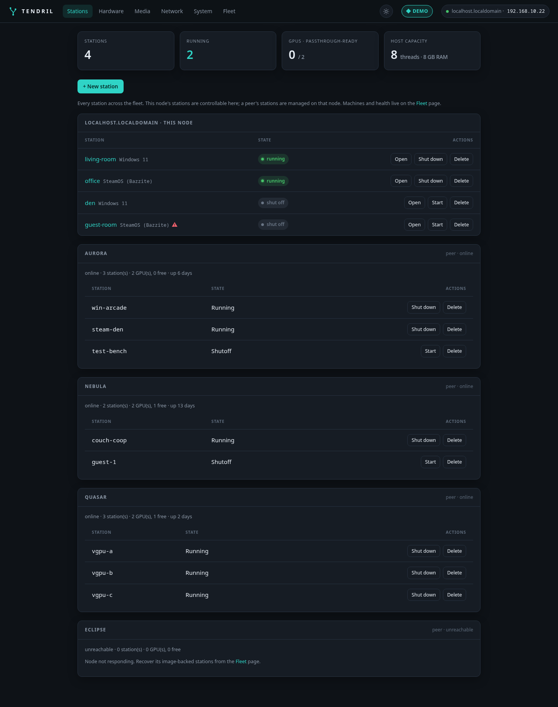
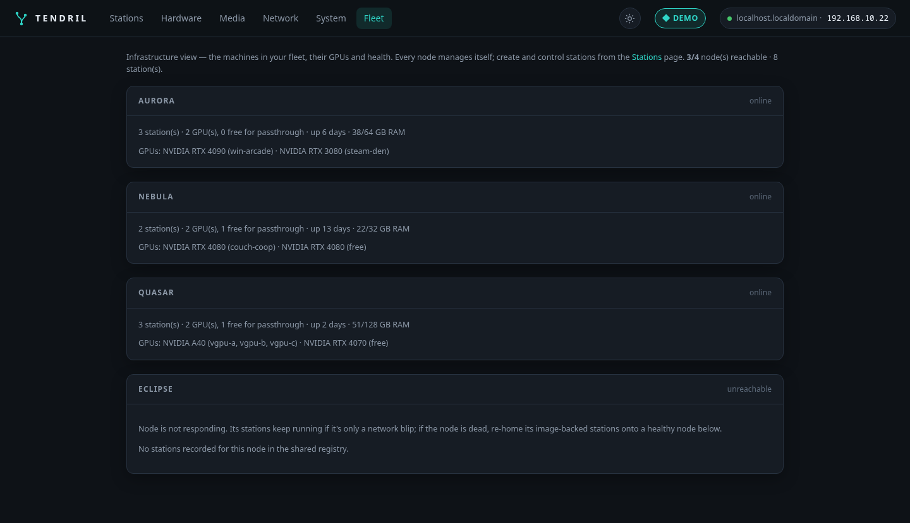

# Tendril

**Tendril** turns one multi-GPU machine into several plug-and-play gaming stations — each a
**Windows** or **SteamOS** VM with a real GPU passed through. It's a self-healing
[Fedora bootc](https://docs.fedoraproject.org/en-US/bootc/) appliance you drive from a web UI or an
on-screen console; it handles IOMMU, VFIO, driver binding, and VM setup so you don't have to.

> **🎮 Live demo:** click around the real web UI (read-only — actions are disabled) at
> **[demo.onetick.ninja](https://demo.onetick.ninja)**. No install needed.



## What is it for?

One powerful box with several GPUs → several independent gaming setups at once. Two people gaming on
one tower, a handful of Steam Machines driven from a closet server, a Windows VM for the games that
need it next to a SteamOS VM for everything else — up to a room of machines imaging themselves over
the network.

- **Passthrough-first:** N GPUs → N independent stations (the reliable path on consumer hardware).
- **Self-healing host:** atomic bootc images with greenboot auto-rollback — a bad update can't brick the box.
- **Own libvirt orchestrator:** full control of passthrough, CPU pinning, and Secure Boot + TPM (for Windows 11).
- **One edition, AGPL:** every feature is open source on every [channel](docs/CHANNELS.md).

## What works today

**Stations.** Create a station from the browser — pick the OS, GPU, and account — and Tendril builds
the disk, the answer-file/kickstart seed, and the VM, then installs the guest **completely
unattended** (Windows 11 past the virtio and Microsoft-account walls, or a SteamOS-style Bazzite
image) and boots from disk. Install media is auto-fetched and checksum-verified; a live in-browser
**noVNC console** and install progress come free. Low-latency mode pins vCPUs to dedicated host
cores and uses hugepages so frame times don't jitter.


**Day-2.** **Snapshots** (restore points before risky updates), **golden images** (capture an
installed station, clone it instantly copy-on-write, push it to stations fleet-wide), optional
**persistent data volumes** that survive OS reinstalls and reimages, USB hot-plug and **seats**
(named USB device groups), and **remote play** — stations run Sunshine, any device runs Moonlight.

**The host.** HTTPS by default with cert management in the UI, admin + read-only **viewer** logins
with an **audit log**, live logs, **configurable networking** with a 60-second test-and-revert
safety net, NFS/SMB **shared storage**, and one-click **OS updates** (staged by bootc, applied on
reboot, auto-rolled-back by greenboot if the new image doesn't boot healthy).

**vGPU** *(🧪 needs real-hardware validation)*. Split one GPU across several stations (mdev or
SR-IOV — see the [supported-card list](docs/VGPU.md)). Stage NVIDIA's licensed host `.run` in the
UI and Tendril **builds the driver image variant on the box**; the matching **guest driver and
licensing are then fully automatic** — new vGPU stations come up licensed with zero manual steps,
and a data-preserving **re-split** changes a station's slice without touching its disk.

**Fleet** *(🧪 needs real-hardware validation)*. Manage several boxes from any one of them:
**join codes** (paste one string — trust, mTLS, and mutual membership included), **mDNS discovery**
of nearby nodes, GPU-aware placement, control of any node's stations from any UI including the
**cross-node console**, golden-image **distribute**, human-confirmed **cold re-home** of an
image-backed station off a dead node, and **PXE room provisioning** — netboot a rack of bare-metal
PCs straight into the unattended installer. ([docs/FEDERATION.md](docs/FEDERATION.md))



**Games at scale.** Bake games into a golden image, or share one Steam library over virtio-fs —
install once, play from many ([docs/STEAM-GAMES.md](docs/STEAM-GAMES.md)).

Drive it all from the web UI, the console on the attached display, or the CLIs
([docs/CLI.md](docs/CLI.md)).

## Install

**Easiest:** download the installer ISO from **https://dl.onetick.ninja/**, verify it against
`SHA256SUMS`, flash it to a USB stick, boot the target, and install. Then open **`https://<host-ip>`**
(self-signed cert — the UI can install a real one), set an admin password, and create your first
station.

Or deploy the **published image** with [`bootc`](https://containers.github.io/bootc/):

```bash
sudo bootc switch git.onetick.ninja/flan/tendril:latest && sudo reboot
```

Three channels are published — rolling `:dev`, per-release `:latest`, and validated `:stable` —
plus matching installer ISOs; releases are cosign-signed. See **[docs/CHANNELS.md](docs/CHANNELS.md)**.

**Prerequisite:** enable **VT-d** (Intel) or **AMD-Vi / IOMMU** (AMD) in your motherboard's firmware —
no software can turn this on for you. Building the image yourself and the full walkthrough:
**[docs/INSTALL.md](docs/INSTALL.md)**. Still pre-1.0; expect rough edges.

## Documentation

| Doc | What's in it |
|---|---|
| [docs/INSTALL.md](docs/INSTALL.md) | Install from ISO, build the image yourself, first station (web + CLI) |
| [docs/CHANNELS.md](docs/CHANNELS.md) | dev / latest / stable channels, what "stable" promises, signing |
| [docs/FEDERATION.md](docs/FEDERATION.md) | Fleets: join codes, mTLS, placement, re-home, PXE — and the design rationale |
| [docs/VGPU.md](docs/VGPU.md) | GPU splitting: supported cards, driver staging, automatic guest driver + licensing |
| [docs/STEAM-GAMES.md](docs/STEAM-GAMES.md) | Getting large game libraries onto many stations |
| [docs/CLI.md](docs/CLI.md) | The command-line tools behind the UI |
| [docs/HARDWARE-TESTING.md](docs/HARDWARE-TESTING.md) | The real-hardware validation checklist (testers start here) |
| [docs/VERSIONING.md](docs/VERSIONING.md) | SemVer policy and how versions are pinned |
| [docs/PLAN.md](docs/PLAN.md) | The original design document (kept for the record, with supersessions noted) |

## Status

Everything in "What works today" is implemented and continuously reviewed; the 🧪 items (vGPU,
fleet/PXE, remote play) are **code-complete but awaiting validation on real multi-GPU hardware** —
[docs/HARDWARE-TESTING.md](docs/HARDWARE-TESTING.md) is the checklist if you can help. Multi-machine
is deliberately **federation, not clustering**: independent self-managing nodes, no consensus, no
live migration (a station *is* its GPU) — the reasoning is in
[docs/FEDERATION.md](docs/FEDERATION.md).

## Contributing

Trunk-based on `dev`, Conventional Commits, changelog per change, and a one-time
[CLA](CLA.md) with your first PR — see **[CONTRIBUTING.md](CONTRIBUTING.md)**. Security issues go to
[SECURITY.md](SECURITY.md), not the issue tracker.

## AI disclosure

Portions of this project — including design documents and code — were produced with the assistance
of AI tools. All output is reviewed by human maintainers before it lands. See [NOTICE](NOTICE).

## License

**[AGPL-3.0-only](LICENSE)** — one edition, every feature open source. Use it freely, commercially
included: running stations you charge for carries no obligations. If you *modify* Tendril and offer
it to others over a network, the AGPL asks you to share those changes; organizations that need
different terms can get a **commercial license** — see **[LICENSING.md](LICENSING.md)**.
