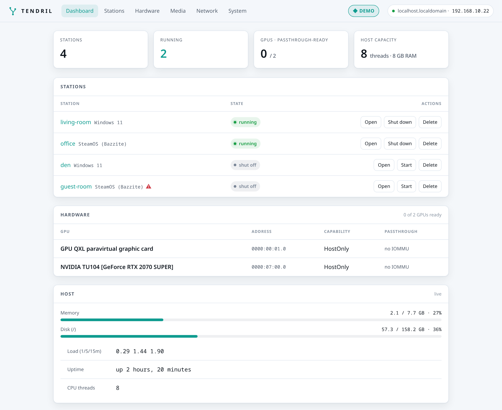
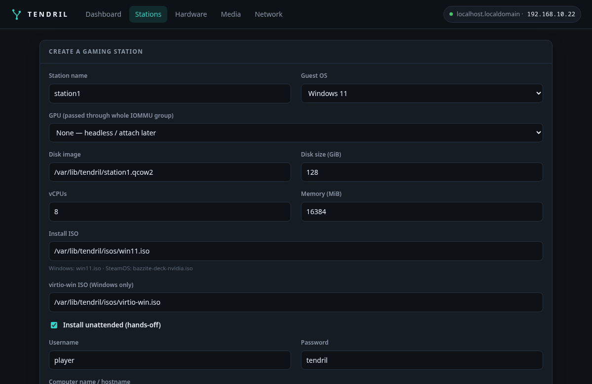
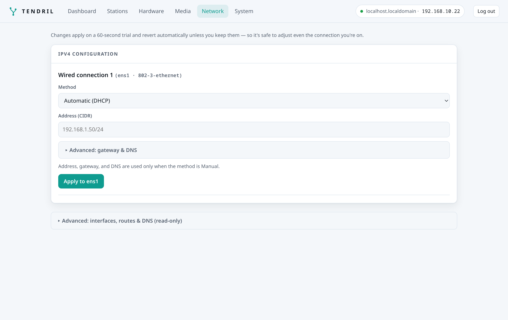

# Tendril

**Tendril** turns one multi-GPU machine into several plug-and-play gaming stations — each a
**Windows** or **SteamOS** VM with a real GPU passed through. It's a self-healing
[Fedora bootc](https://docs.fedoraproject.org/en-US/bootc/) appliance you drive from a web UI or an
on-screen console; it handles IOMMU, VFIO, driver binding, and VM setup so you don't have to.

> **🎮 Live demo:** click around the real web UI (read-only — actions are disabled) at
> **[demo.onetick.ninja](https://demo.onetick.ninja)**. No install needed.



## What is it for?

One powerful box with several GPUs → several independent gaming setups at once. Two people gaming on
one tower, a handful of Steam Machines driven from a closet server, a Windows VM for the games that
need it next to a SteamOS VM for everything else.

- **Passthrough-first:** N GPUs → N independent stations (the reliable path on consumer hardware).
- **Self-healing host:** atomic bootc images with greenboot auto-rollback — a bad update can't brick the box.
- **Own libvirt orchestrator:** full control of passthrough, CPU pinning, and Secure Boot + TPM (for Windows 11).
- **vGPU & clustering later:** more VMs per GPU, and management across multiple machines.

## What works today

A **web control plane** (Axum + HTMX) and a TrueNAS-style **on-screen console**, both over one
libvirt orchestrator. Create a station from the browser — pick the OS, GPU, and account — and Tendril
builds the disk, the answer-file/kickstart seed, and the VM, then installs the guest **unattended**
(Windows 11 past the virtio and Microsoft-account walls, or a SteamOS-style Bazzite image) and boots
from disk.



Along the way: **seats** (named USB device groups), **auto-fetched + checksum-verified** install
media, **live install progress**, per-GPU `vfio-pci` binding, a live in-browser **noVNC console**,
password auth, and **configurable networking** with a 60-second **test-and-revert** safety net.



Drive it all from the web UI, the console, or the CLIs — see **[docs/CLI.md](docs/CLI.md)**.

## Install

**Easiest:** download the installer ISO from **https://dl.onetick.ninja/**, verify it against
`SHA256SUMS`, flash it to a USB stick, boot the target, and install.

Or deploy the **published image** with [`bootc`](https://containers.github.io/bootc/) — pushed to
Tendril's own registry (tags `latest` and the current version):

```bash
sudo bootc switch git.onetick.ninja/flan/tendril:latest && sudo reboot
```

Once it's up, open the **web UI** at `http://<host-ip>/` and set an admin password, or use the
`tendril` console on the attached display.

**Prerequisite:** enable **VT-d** (Intel) or **AMD-Vi / IOMMU** (AMD) in your motherboard's BIOS — no
software can turn this on for you. Building the image yourself, deploying, and creating your first
station are covered in **[docs/INSTALL.md](docs/INSTALL.md)**. Still pre-1.0; expect rough edges.

## Roadmap

Detection, VFIO plan/apply, the installer ISO, libvirt orchestration, unattended Windows/Bazzite
installs, the console, and the web control plane (incl. networking) are **done** — that's the
"What works today" above. Ahead:

| Area | Capability | Status |
|---|---|---|
| vGPU | >1 VM per GPU — mdev (official + `vgpu_unlock`) & SR-IOV — see **[docs/VGPU.md](docs/VGPU.md)** | 🧪 Experimental (needs hardware validation) |
| Federation | Manage a fleet of nodes from one UI; GPU-aware placement + assisted re-home — see **[docs/FEDERATION.md](docs/FEDERATION.md)** | 🧪 Experimental |
| Streaming | Sunshine/Moonlight for headless / remote play | 🔭 Future |

Full architecture, decisions, and phase detail: **[docs/PLAN.md](docs/PLAN.md)**.

## Contributing

Trunk-based on `dev`, Conventional Commits, changelog per change — see
**[CONTRIBUTING.md](CONTRIBUTING.md)**.

## AI disclosure

Portions of this project — including design documents and code — were produced with the assistance
of AI tools. All output is reviewed by human maintainers before it lands. See [NOTICE](NOTICE).

## License

TBD — see the open questions in [docs/PLAN.md](docs/PLAN.md).
